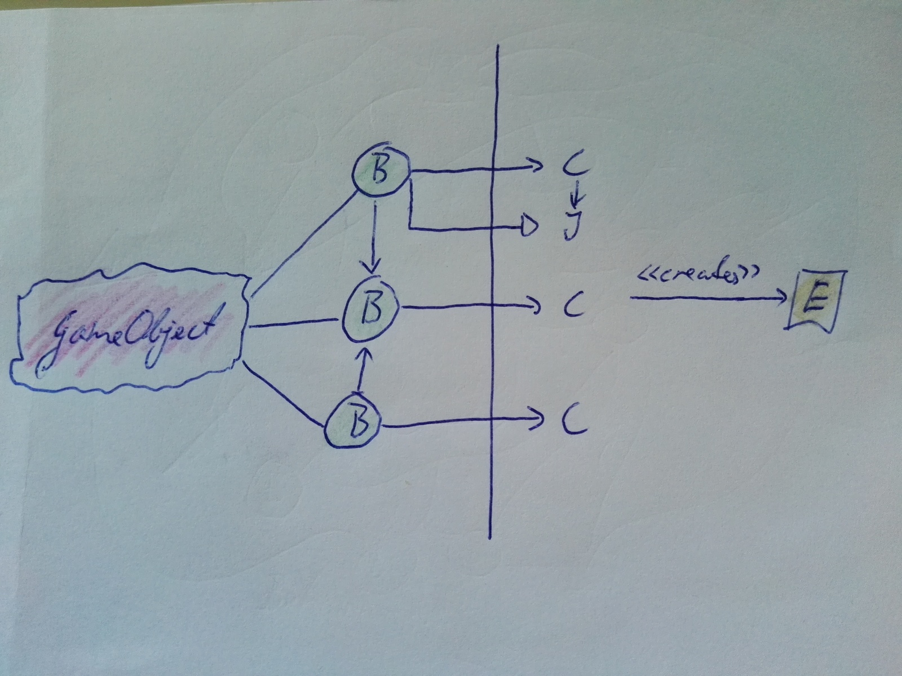

# Intro

God kveld (eller god morgen, eller hva det er når du leser dette), jeg har en idé, og jeg har tanker om å prøve den ut.

Så: I morgen, torsdag, etter lunsj, dukker jeg opp her, med blanke ark, fargestifter, klipp-og-lim-tasten og noen tanker om hvordan vi skal angripe det å lage en prototype, sett fra et Software Engineering-type ståsted, og så begynner jeg å skrive, tegne og forklare. Siden det er asynkront, kan de som er interesserte følge med, og jeg håper på å få spørsmål, innspill og kommentarer slik at dette ikke blir en "ivory tower architect"-utlegning. Det vi kommer frem til underveis havner i en .md-fil som blir .pdf når vi er ferdige.

Faktisk er det en tretrinnsrakett:

* Jeg begynner med bokser og piler, forklarer hvorfor pilene peker dit de gjør, hva som ville skjedd om de pekte en annen vei, osv. Så viser jeg et lite spill, om jeg finner ut hvordan jeg gjør video capture.
* Så begynner det å dryppe kodeeksempler, fil for fil, eller metode for metode; tanken er å prøve å vise hva arkitektur på papiret kan se ut som - helt strippet for magisk infrastruktur (med ett unntak, se under); tester, kode, arbeidsflyt.
* Når eksempelet er forklart, vil jeg laste opp koden i sin helhet til GitHub, og da er det fint om noen har tid/lyst til å (sammen eller alene) laste ned, starte opp og finne på en feature å realisere, med tester. Så kan vi diskutere fremgangsmåten og snublestener underveis - er det lett å finne ut hvor man skal legge ting, ser vi fortsatt det store bildet når fingrene er fulle av variabler, manglende semikolon og generics?

Det er én ting jeg vil at de som er interessert skal gjøre, og det er å (om nødvendig) friske opp Dependency Injection/Inversion of Control; se for eksempel Wikipedia: https://en.wikipedia.org/wiki/Dependency_injection eller en artikkel fra vår venn Martin Fowler (fra 2004, men dette er grunnleggende teori, så det går ikke ut på dato): http://www.martinfowler.com/articles/injection.html (ikke les om Service Location, det skal vi ikke bruke).

En oppsummering for femåringer, om man ikke vil lese lange utlegninger (sakset fra Wikipedia):

>When you go and get things out of the refrigerator for yourself, you can cause problems. You might leave the door open, you might get something Mommy or Daddy doesn't want you to have. You might even be looking for something we don't even have or which has expired.
>
>What you should be doing is stating a need, "I need something to drink with lunch," and then we will make sure you have something when you sit down to eat.
>
>John Munsch, 28 October 2009

Sees!

PS, om man vil lese om DI i en Unity-kontekst, sjekk ut Zenject, der finnes også litt forklaringer på konseptet (og dokumentasjon vi alle skal bli glade i...): https://github.com/modesttree/Zenject/


# Okidoki
* [Prosjektet på github](https://github.com/communicaretools/unitydemo)


Som alle andre rammeverk, trives Unity med å være begivenhetenes midtpunkt, og arkitekturen er i utgangspunktet komponentbasert: Vi legger på små, uavhengige biter med oppførsel - `MonoBehaviour`s - og realiserer spillet gjennom disse. I tegningen står **B** for Behaviour.


Av og til må vi imidlertid tilføre tilstand utenfor komponentene, og mye kode som finnes på Internettet har en tendens til å løse den type utfordringer med `singletons`, global tilstandsdeling som kommunikasjonsmekanisme. Kanskje har man ikke noe valg i det miljøet Unity i utgangspunktet er. I tegningen står **S** for State.


I tillegg må vi også ofte ha kode som ikke har noe med rammeverket å gjøre i det hele tatt, for eksempel I/O, det havner litt ute på siden og knytter seg inn i systemet der det trengs. Allerede melder et interessant spørsmål seg: Hva er skopet til en test, for eksempel av I/O-funksjonaliteten, i denne sammenhengen?


Det går an å fortsette på denne måten, men uten en helhetlig plan blir det store bildet lett mer og mer uoversiktlig - for, hva er en tillatt avhengighet, og hvilke avhengigheter lønner det seg ikke å ta? Hva er i det hele tatt det store bildet?


Når tiden går og flere utviklere sammen mister oversikten, dukker problemene opp: I denne figuren - hvilke konsekvenser vil en endring ha? Om vi sletter eller endrer `MonoBehaviour`'ene som er krysset ut, hvordan får designeren vite det, og hva gjør vi med den koden som er avhengig av disse? Kan de slettes?


Det første vi må gjøre, er å trekke en grense - en `boundary` - hvor vi isolerer samhandlingen med rammeverket på den ene siden og flytter all spillogikken ut av `MonoBehaviour`'ene og over på den andre. Et enkelt grep, men vi har plutselig fått hendene frie til å utøve normalt sunt software design på høyre side av streken. Merk også retningen på pilene, de gjør at vi kan teste kjernekoden uten å måtte involvere Unity. Det gjør at utviklerne kan sitte og jobbe hovedsakelig i VS/MD, at vi slipper å switche frem og tilbake mellom Unity og IDE'en vi bruker (Unity regenererer solution- og prosjektfiler ganske ofte, og hver gang får vi litt ventetid i IDE'en). Apropos boundaries: Uncle Bob har et nyttig foredrag som finnes her: http://confreaks.tv/videos/rubymidwest2011-keynote-architecture-the-lost-years se også en artikkel om emnet: http://www.cs.sjsu.edu/~pearce/modules/patterns/enterprise/ecb/ecb.htm


Noen drar kanskje kjensel på dette som en ports-and-adapters eller heksagonal arkitektur: http://alistair.cockburn.us/Hexagonal+architecture - eller en form for MVC


Nå trengs det gjerne toveis kommunikasjon mellom kjernekoden og den koden som viser noe - hvordan ellers skal vi kunne vise resultatene av det kjernen kommer frem til? Måten å gjøre dette på er en instans av Inversion of Control: I stedet for å depend'e direkte på en `MonoBehaviour` lager vi et interface innenfor kjernen, og så lar vi en klasse utenfor boundary'en implementere. Dette interfacet er der for testbarhet og ensretting av avhengigheter.


Dette mønsteret kan vi så gjenta flere ganger, og det virker for andre sammenhenger enn `MonoBehaviour` også, for eksempel for å bruke GUI- eller I/O-funksjonaliteten i Unity. Tilstanden kan vi holde orden på i en normal domenemodell, og siden spillprogrammering er temmelig hendelsesstyrt, er det fornuftig å dra inn et opplegg for å kommunisere nettopp gjennom hendelser (heller enn felles tilstand).

Her kommer første lille utfordring: **Hva skal barnet hete?** Man kan argumentere for at dette kan kalles en variant av MVC, hvor `MonoBehaviour` blir *view* og den klassen som medierer og koordinerer på innsiden blir *controller*, med domenemodellen som *model*, men andre muligheter finnes - bekymringen er at begrepet *controller* tar med seg en haug med assosiasjoner, spesielt siden tykklient-MVC er forskjellig fra web-MVC. Hadde det vært bedre å følge Uncle Bob og kalle det Behaviour-Interactor-Entity? Behaviour-Interactor-Model? Behaviour-Coordinator-Model? View-ViewModel-Model (MVVM)? Behaviour-Controller-Model?

Det viktigste er at vi finner et navn som gjør at vi alle har samme syn på ting.
Vi får ha det spørsmålet i bakhodet.


Her forlater vi papiret for en stund fremover, til fordel for et eksempel. Først, se på filstrukturen til venstre: Vi må ha et mål om at allerede her kommuniserer koden hva det dreier seg om. Hvilke forventninger har vi til spillet ut fra de øverste katalogene? To andre prosjekter er vist til høyre - ett av dem sier "jeg er et angular-prosjekt", det andre sier noe annet.

*...*


Her er en designskisse til spillet. Legg merke til at jeg først tenkte på å legge det meste under `Player`, kanskje en litt dataorientert tankegang? Allerede her er en del av moduloppdelingen på plass.

Her kommer utdrag fra koden, case by case.

```cs
namespace Neighbourhood.Game.Outdoors.FirstPersonPlayer
{
	public enum MovementDirection
	{
		Still,
		Forward,
		Backward
	}

	public enum RotationDirection
	{
		None,
		Left,
		Right
	}

	public enum InputSource
	{
		Input,
		Touch
	}

	public class InputState
	{
		public InputSource Source { get; set; }
		public MovementDirection Direction { get; set; }
		public RotationDirection Rotation { get; set; }
	}
}
```
Først, hvordan flytter vi oss rundt i førsteperson? For å realisere både keyboard- og touch-basert navigering, og for å overholde Single Responsibility Principle, har jeg representert input i øyeblikket som en egen klasse, den angir gangretning og rotasjonsretning. Helt alminnelig C#-klasse.

```cs
using Zenject;
using Neighbourhood.Game.UnityIntegration.Abstractions.Components;

namespace Neighbourhood.Game.Outdoors.FirstPersonPlayer
{
	public interface IMovePlayerView : IHasTransform
	{
	}

	public class MovePlayerController
	{
		readonly InputState state;
		readonly PlayerSettings.Movement settings;
		IMovePlayerView player;

		[Inject]
		public MovePlayerController(InputState state, PlayerSettings.Movement settings)
		{
			this.settings = settings;
			this.state = state;
		}

		public void Init(IMovePlayerView player)
		{
			this.player = player;
		}

		public void Update(float deltaTime)
		{
			if (player == null) { return; }
			if (state.Direction == MovementDirection.Forward)
			{
				player.Transform.Position += player.Transform.Forward * settings.ForwardSpeed * deltaTime;
			}
			else if (state.Direction == MovementDirection.Backward)
			{
				player.Transform.Position -= player.Transform.Forward * settings.ForwardSpeed * deltaTime;
			}
			if (state.Rotation == RotationDirection.Right)
			{
				player.Transform.Rotate(0f, settings.RotationSpeed * deltaTime, 0f);
			}
			else if (state.Rotation == RotationDirection.Left)
			{
				player.Transform.Rotate(0f, -settings.RotationSpeed * deltaTime, 0f);
			}
		}
	}
}
```
Så, en controller. Legg merke til at dette er en helt alminnelig C#-klasse, og at den tar inn avhengighetene på to måter: I constructoren (fra IoC-containeren) og i en egen funksjon (Init(..), fra view'et). Dette er fordi Unity lager view'et.

```cs
using NUnit.Framework;
using Neighbourhood.Game.Outdoors.FirstPersonPlayer;
using UnityEngine;

namespace Neighbourhood.Editor.Tests.Outdoors.Player
{
	[TestFixture]
	public class WhenPlayerMoveHandlerObservesTheInputState
	{
		PlayerStub player;
		InputState input;
		MovePlayerController handler;

		[SetUp]
		public void Given()
		{
			player = new PlayerStub();
			input = new InputState();
			var settings = new PlayerSettings.Movement {
				ForwardSpeed = 2f,
				RotationSpeed = 10f
			};
			handler = new MovePlayerController(input, settings);
			handler.Init(player);
		}

		[Test]
		public void AtRestNothingHappens()
		{
			input.Direction = MovementDirection.Still;
			input.Rotation = RotationDirection.None;
			handler.Update(1f);
			Assert.That(player.Transform.Position, Is.EqualTo(new Vector3()));
			Assert.That(player.Transform.Rotation, Is.EqualTo(new Vector3()));
		}

		[Test]
		public void ForwardMovementMovesThePlayerForward()
		{
			input.Direction = MovementDirection.Forward;
			handler.Update(1f);
			Assert.That(player.Transform.Position, Is.EqualTo(2 * player.Transform.Forward));
		}

		// ...snip...

		class PlayerStub : BaseBehaviourStub, IMovePlayerView {}
	}
}
```
Dette er det enkelt å skrive tester for.

```cs
using Neighbourhood.Game.UnityIntegration.Implementation;
using Zenject;
using UnityEngine;

namespace Neighbourhood.Game.Outdoors.FirstPersonPlayer
{
	public class MovePlayerBehaviour : BaseBehaviour, IMovePlayerView
	{
		MovePlayerController controller;

		[Inject]
		public void Init(MovePlayerController controller)
		{
			this.controller = controller;
			controller.Init(this);
		}

		void Update()
		{
			controller.Update(Time.deltaTime);
		}
	}
}
```

Siste brikke i spillet er `MonoBehaviour`'en som designeren legger på spillerobjektet (hovedkameraet i dette tilfellet). Denne klassen har ingen logikk, den bare forwarder Update()-hendelsen til controlleren - ved å sende med deltaTime, slipper vi at controlleren er avhengig av Time-klassen, og vi bevarer testbarheten.

Neste case er litt interessant: Hvordan blir modellen til - kan vi lage oss en representasjon av den verdenen som designeren har laget på en måte som gjør at vi kan resonnere om den utenfor konteksten av én enkelt `MonoBehaviour`?


Designeren definerer objekter, og han kan gjøre dem unike ved å sette properties på dem i editoren. Dette kan vi fange opp og utnytte for å lage oss en representasjon "på innsiden", som gjør at vi kan få vite om de elementene som finnes der vi trenger den informasjonen. `Installer` i bildet vil jeg komme tilbake til.

```cs
using System.Collections.Generic;
using System.Linq;

namespace Neighbourhood.Game.Inventory
{
	public class Inventory
	{
		readonly InventoryItemAddedSignal.Trigger trigger;
		readonly IList<Item> items;
		public IEnumerable<Item> Items { get { return items; } }

		public Inventory(InventoryItemAddedSignal.Trigger trigger)
		{
			this.trigger = trigger;
			items = new List<Item>();
		}

		public void Add(Item item)
		{
			items.Add(item);
			trigger.Fire(item);
		}

		public IEnumerable<T> GetItemDataOfType<T>()
		{
			return items.Where(i => i.Data is T).Select(i => (T)i.Data);
		}
	}
}
```
Tenk for eksempel på `Inventory`, tingene spilleren plukker opp underveis. Denne implementasjonen er ganske rett frem. Det at vi fyrer av en hendelse underveis får vi bruk for senere - det er en måte å lage et integrasjonspunkt på som gjør at vi kan legge til funksjonalitet uten å røre/destabilisere eksisterende kode.

Igjen, containeren injiserer instansen av `InventoryItemAddedSignal.Trigger` som gjør oss i stand til å fortelle at en hendelse har funnet sted.

```cs
using UnityEngine;
using Zenject;
using Neighbourhood.Game.Inventory;
using System;

namespace Neighbourhood.Game.Outdoors.Houses
{
	[RequireComponent(typeof(Collider))]
	public class AllowKeyToBePickedUpBehaviour : MonoBehaviour
	{
		Inventory.Inventory inventory;
		public Settings KeyInfo;

		[Inject]
		public void Init(Inventory.Inventory inventory)
		{
			this.inventory = inventory;
		}

		void OnCollisionEnter(Collision collision)
		{
			if (collision.gameObject.CompareTag("MainCamera"))
			{
				inventory.Add(new Item(KeyInfo.Name, KeyInfo.Data));
				Destroy(this.gameObject);
			}
		}

		[Serializable]
		public class Settings
		{
			public string Name;
			public Key Data;
		}
	}

}
```

Her er en `MonoBehaviour`som gjør jobben direkte, uten controller, for korthets skyld i presentasjonen. Legg merke til navnet - `AllowKeyToBePickedUpBehaviour` - det gjør det mindre sannsynlig at nestemann kommer og legger til noe som "nesten hører hjemme" der, det oppmuntrer til å etterleve SRP (Single Responsibility Principle).

Her legger designeren til en nøkkel i scenen og limer denne behaviour'en på nøkkelen. Så kan han angi hvilken nøkkel det er snakk om i settings for objektet. Når spilleren ankommer, opprettes en entitet som legges til i `Inventory`


```cs
using System;
using Neighbourhood.Game.FlashMessages;
using Neighbourhood.Game.Places;

namespace Neighbourhood.Game.Outdoors.Houses
{
	public class TryToUnlockHouseWhenArrivingController
	{
		House house;
		readonly HouseRegistry registry;
		readonly Inventory.Inventory inventory;
		readonly ShowMessageCommand showMessage;
		readonly EnterHouseCommand loadLevel;

		public TryToUnlockHouseWhenArrivingController(HouseRegistry registry, Inventory.Inventory inventory, ShowMessageCommand showMessage, EnterHouseCommand loadLevel)
		{
			this.loadLevel = loadLevel;
			this.showMessage = showMessage;
			this.inventory = inventory;
			this.registry = registry;
		}

		public void Initialize(HouseData data)
		{
			house = new House(data);
			registry.AddHouse(house);
		}

		public void PlayerArrived()
		{
			var couldUnlock = TryToUnlock();
			if (!couldUnlock)
			{
				showMessage.Execute("You don't have the correct key to unlock this house");
				return;
			}
			loadLevel.Execute(house.LevelToLoad);
		}

		bool TryToUnlock()
		{
			foreach (var key in inventory.GetItemDataOfType<Key>())
			{
				if (house.AttemptToUnlock(key))
				{
					return true;
				}
			}

			return false;
		}
	}
}
```
Her er koden som bruker nøkkelen, om den finnes. Den er koblet til en helt enkel `MonoBehaviour` som kaller `Initialize()` og `PlayerArrived()` til rett tid. Ved vellykket opplåsing fyrer den av en kommando med beskjed om å gå inn i et gitt hus.

En ting som ikke vises så direkte i videoen, er hvordan tilstanden bevares på tvers av sceneskift. Her kommer Zenject inn i bildet, og jeg skal prøve å tegne litt igjen.


Zenject holder på informasjon om hvilke klasser som implementerer hvilken funksjonalitet, samt livssyklusinformasjon for hver enkelt klasse (singleton? instans per klienttype? instans per klient? etc). I tillegg er det alltid *to* nivåer i spill, de kalles *Context*, *ProjectContext* og *SceneContext*. Førstnevnte er realisert som en *Prefab* i *Resources*-katalogen i prosjektet, og Zenject laster inn denne ved oppstart og holder den i minnet. Alt som er registrert her overlever sceneskift. *SceneContext* legger designeren til for hver scene og velger hvilken funksjonalitet som skal inkluderes for den scenen; jeg ser for meg at vi pakker én *Installer* per scene(type) for enkelthets skyld. Begge contexter kan ha *Settings* på seg, så det er mulig å angi innstillinger for spillet og for hver scene. Når man resolver dependencies i en *SceneContext*, leter Zenject først her, siden i foreldrekonteksten, *ProjectContext*. Hvis noen synes dette minner om subcontainere så er det helt riktig.

```cs
using System;
using Zenject;
using Neighbourhood.Game.UnityIntegration.Implementation;
using Neighbourhood.Game.Inventory;
using Neighbourhood.Game.FlashMessages;
using Neighbourhood.Game.Places;

namespace Neighbourhood.Game
{
	public class GameInstaller : MonoInstaller
	{
		public GameSettings Settings;

		public override void InstallBindings()
		{
			InventoryInstaller.Install(Container, Settings.Inventory);
			FlashMessagesInstaller.Install(Container, Settings.FlashMessages);
			PlacesInstaller.Install(Container);
			UnityIntegrationInstaller.Install(Container);
		}

		[Serializable]
		public class GameSettings
		{
			public FlashMessageSettings FlashMessages;
			public InventoryInstaller.InventorySettings Inventory;
		}
	}
}
```
Her er rotnivåinstalleren for spillet; legg merke til at den kaller videre på andre installere - ved å legge én installer i hver modul unngår vi å ha ett sentralt sted i applikasjonen som vet alt, og når vi koder, kan vi konsentrere oss om én katalog.

```cs
using Zenject;
using System;

namespace Neighbourhood.Game.Inventory
{
	public class InventoryInstaller : Installer<InventoryInstaller.InventorySettings, InventoryInstaller>
	{
		InventorySettings settings;

		public InventoryInstaller(InventorySettings settings)
		{
			this.settings = settings;
		}

		public override void InstallBindings()
		{
			Container.BindSignal<InventoryItemAddedSignal>();
			Container.BindTrigger<InventoryItemAddedSignal.Trigger>();

			Container.BindInstance(settings.RendererPositioning);
			Container.Bind<Inventory>().ToSelf().AsSingle();
			Container.BindAllInterfaces<ShowMessageOnInventoryItemAdded>().To<ShowMessageOnInventoryItemAdded>().AsSingle();
			Container.Bind<InventoryRenderer>().ToSelf().FromGameObject().AsSingle().NonLazy();
		}

		[Serializable]
		public class InventorySettings
		{
			public InventoryRenderer.Settings RendererPositioning;
		}
	}
}
```
Her er en løvnode i `Installer`-treet, installeren for `Inventory`. Den tar inn settings fra `GameInstaller`.

Interessant ting: Se på linjen som binder `InventoryRenderer`(linje 23). `FromGameObject()` betyr at Zenject oppretter et nytt, tomt gameobject runtime og legger på den angitte `MonoBehaviour`'en - perfekt for å lage overlays med informasjon, eller for å få inn annen slags oppførsel som ikke hører hjemme på noe konkret objekt i scenen.

Det siste caset vi skal se på er litt spesielt: Hva gjør vi når vi vil ha én enkelt representasjon av et objekt, men det aktuelle game-objektet har flere, finkornede behaviours som alle trenger tilgang til objektet? Hvordan fordeler vi så ansvaret?


Her er situasjonen i utgangspunktet: Tre behaviours, hver sin kontroller. Hvem har ansvar for å opprette en entity?


En mulig løsning er å lage en ny, separat controller som har kun det ansvaret - så lenge det bare finnes ett gameobject av denne typen, så lenge vi kan angi livssyklusen til den nye controlleren som singleton.

Videre: Zenject støtter skop helt ned på `GameObject`-nivå, og da vil denne planen fungere, men det er en del oppsett ved det.


Hvis vi sier at én av de tre har ansvaret for å opprette en entity...


..kan vi gjøre de dataene tilgjengelige for andre ved at de behaviour'ene som ikke har dataene i sin controller tilgjengeliggjør dem ved å gjøre `GetComponent<T>()` og eksponerer dem over view-interfacet sitt. Vi skal unngå for mye avhengigheter mellom behaviours direkte, men denne tror jeg vi skal akseptere.

```cs
using System;
using Neighbourhood.Game.UnityIntegration.Implementation;
using UnityEngine;

namespace Neighbourhood.Game.Indoors.Visitables
{
	public class VisitableItemBehaviour : BaseBehaviour, IVisitableItem
	{
		[SerializeField]
		VisitableItemSettings settings = new VisitableItemSettings();

		#region IVisitableItem implementation
		public string Name { get { return string.IsNullOrEmpty(settings.Name) ? gameObject.name : settings.Name; } }
		#endregion

		[Serializable]
		class VisitableItemSettings
		{
			public string Name;
		}
	}
}
```
Her er et forenklet eksempel - denne behaviour'en implementerer dataene selv i stedet for å gå til en controller, men prinsippet blir det samme.

```cs
using UnityEngine;
using Zenject;

namespace Neighbourhood.Game.Indoors.Visitables
{
	[RequireComponent(typeof(VisitableItemBehaviour))]
	public class TestableGlowWhenApproachedBehaviour : MonoBehaviour, IGlowWhenApproached
	{
		// ...snip...

		public IVisitableItem Item { get; private set; }

		[Inject]
		public void Init(GlowWhenApproachedController controller, VisitableGlobalSettings settings)
		{
			// ...snip...
			Item = GetComponent<VisitableItemBehaviour>();
			controller.InitView(this);
		}

		// ...snip...
	}
}
```
Dette kan controlleren bruke, for property'en `Item` er eksponert på interfacet.

Speaking of `TestableGlowWhenApproachedBehaviour`...tester. Hvor går grensen? Det frister jo å si at alt som er nitty-gritty-detaljfikling med animasjonstilpasning og grafiske effekter kan gå utenfor test. La oss prøve: I videoen vises det at enkelte ting lyser/gløder når spilleren nærmer seg. En ganske rent visuell effekt.

```cs
using System;
using UnityEngine;
using Zenject;
using Neighbourhood.Game.Indoors.ThirdPersonPlayer;

namespace Neighbourhood.Game.Indoors.Visitables
{
	[RequireComponent(typeof(VisitableItemBehaviour))]
	public class UntestableGlowWhenApproachedBehaviour : MonoBehaviour, IDisposable
	{
		bool glowing = false;
		Material originalMaterial;
		new Renderer renderer;
		IVisitableItem me;

		[Inject] PlayerDestinationChangedSignal DestinationChanged { get; set; }
		[Inject] PlayerArrivedAtDestinationSignal DestinationReached { get; set; }
		[Inject] VisitableGlobalSettings Settings { get; set; }

		[Inject]
		public void Init()
		{
			renderer = GetComponent<Renderer>();
			originalMaterial = renderer.material;
			me = GetComponent<IVisitableItem>();
			DestinationChanged.Event += GlowIfApproachingMe;
			DestinationReached.Event += StopGlowing;
		}

		void GlowIfApproachingMe(PlayerDestinationChangedSignal.Arguments args)
		{
			var supposedToGlow = args.Destination == me;
			if (!supposedToGlow)
			{
				if (glowing)
				{
					StopGlowing();
				}
			} else
			{
				StartGlowing();
			}
		}

		void StartGlowing()
		{
			renderer.material = Settings.GlowMaterial;
			glowing = true;
		}

		void StopGlowing(IPlayerDestination destination = null)
		{
			glowing = false;
			renderer.material = originalMaterial;
		}

		#region IDisposable implementation

		public void Dispose()
		{
			DestinationChanged.Event -= GlowIfApproachingMe;
			DestinationReached.Event -= StopGlowing;
		}

		#endregion
	}
}
```

Her er en implementasjon. I starten var den temmelig enkel, men så ballet det fort på seg: Hva om brukeren klikker på noe annet før han har kommet helt frem? Plutselig må vi lytte på litt flere signaler, holde rede på hvem det er som skal lyse og sørge for oppdrydning av abonnement på hendelser. Tid for testing?


```cs
using UnityEngine;
using Zenject;

namespace Neighbourhood.Game.Indoors.Visitables
{
	[RequireComponent(typeof(VisitableItemBehaviour))]
	public class TestableGlowWhenApproachedBehaviour : MonoBehaviour, IGlowWhenApproached
	{
		new Renderer renderer;
		Material originalMaterial;
		GlowWhenApproachedController controller;

		public IVisitableItem Item { get; private set; }

		[Inject]
		public void Init(GlowWhenApproachedController controller)
		{
			this.controller = controller;
			this.renderer = GetComponent<Renderer>();
			this.originalMaterial = renderer.material;

			Item = GetComponent<VisitableItemBehaviour>();
			controller.InitView(this);
		}

		#region IGlowWhenApproached implementation

		public void Glow()
		{
			renderer.material = settings.GlowMaterial;
		}

		public void StopGlowing()
		{
			renderer.material = originalMaterial;
		}

		#endregion

		void OnDestroy()
		{
			controller.Dispose();
		}
	}
}
```

Her er koden etter logikken er trukket ut - dette er jeg komfortabel med å la stå utestet. Det går an å kjøre tester inne i Unity,  og da kan vi instansiere GameObjects osv, men det medfører kontekstskift, kjøring av tester i en ikke-ideell test-runner, og det kan være vanskelig å gjenskape situasjoner med flere GameObjects. Dessuten: Alt man lager blir lagt til i scenen, for så å bli Undo'et...what could possibly go wrong?

Legg merke til bruken av `[RequireComponent(typeof(VisitableItemBehaviour))]` - dette er viktig for å få en best mulig arbeidsflyt mellom oss og design, at vi er tydelige på hvilke komponenter som trenger hverandre, etc. Dette gjelder selvsagt også standard-ting som Collider, Rigidbody, etc.

Noe av det kan vi faktisk automatisere, og kodebasen inneholder en mappe med tester, `Validation` som gir denne slags meldinger:

```
 The MonoBehaviour Neighbourhood.Game.Indoors.Visitables.NavigateHereOnClickBehaviour declares the handler method OnMouseUpAsButton, but is missing the corresponding [RequireComponent(Collider)] annotation
 Expected: collection containing <UnityEngine.Collider>
 But was:  <empty>
```

## Så, litt wrap-up.

Må inn i kjernen:
* Hendelser som har betydning i spillet, når noe skjer
* All tilstand som
 * ...brukes som grunnlag for å ta beslutninger
 * ...kommuniseres til andre klasser
* Alle beslutninger om spillets gang
* All kommunikasjon mellom komponenter

Kan leve i utestede klasser:
* Detaljinteraksjon med fysikk og animasjon
* Rent visuelle effekter (f.eks. kameravignettering, zoomeffekter, etc)
* Implementasjon av enkle wrappere rundt Unity-funksjonalitet

Ting å legge merke til:
* Navngivning ut fra hva komponenten *betyr i domenet* fremfor hva den gjør. Eksempel: Å skifte til neste "level" kan hete *EnterRoomCommand* heller enn *LoadSceneCommand*, om det "å gå inn i et rom" er en del av vokabularet i spillets verden. Man vil da tilsvarende ha *ExitRoom* i stedet for *UnloadLevel*.
* Modulariseringen: Avhengighetene kan gå på tvers mellom siblings eller oppover i hierarkiet; med unntak av installere ikke innover, og ikke mellom andre grener i treet (unntatt infrastruktur)
* Avhengigheter kveler - hva skal vi gjøre for å være obs på hva som er avhengig av hva? Må ta avhengighet på noe et annet sted, dvs praktisere Inversion of Control, flytte det to ting er avhengige av til et tredje sted som de to opprinnelige kan referere.


```cs
// ...snip usings...
namespace Neighbourhood.Game.Indoors.Visitables
{
	public interface IExitHouseView
	{
		IVisitableItem Item { get; }
	}

	[RequireComponent(typeof(VisitableItemBehaviour))]
	public class ExitHouseWhenArrivedAtBehaviour : BaseBehaviour<ExitHouseOnArrivalController, IExitHouseView>, IExitHouseView
	{
		public IVisitableItem Item { get { return GetComponent<VisitableItemBehaviour>(); } }
	}

	public class ExitHouseOnArrivalController : Controller<IExitHouseView>
	{
		[Inject] public PlayerArrivedAtDestinationSignal PlayerArrived { get; set; }
		[Inject] public ExitHouseCommand Exit { get; set; }

		public override void Init(IExitHouseView view)
		{
			base.Init(view);
			SubscribeToSignal(PlayerArrived,
				(IPlayerDestination dest) => {
					if (dest == View.Item)
					{
						Exit.Execute();
					}
				});
		}
	}
}
```
Så langt har jeg vist kode som bruker minimalt med infrastruktur, vil bare vise hva som kan være mulig med en enkel baseklasse: Her håndteres knytning mellom behaviour og controller, samt subscription og de-subscription av events på riktig måte med minimalt med kode -> enklere å gjøre ting rett!

Det siste som jeg ikke har touchet så mye på, er _hendelser_, i Zenject støttet ut av boksen som `Signal`/`Trigger` og `Command`, hvor forskjellen er at et `Signal` forteller om noe som har skjedd, mens en `Command` er en oppfordring om noe som skal finne sted. Disse gjør det mulig å løse krav av typen "Når X skjer, skal Y skje", som det er ganske mange av i denne type applikasjoner.

Eksempel: "Når spilleren plukker opp en gjenstand, skal en lyd spilles av, en melding vises på skjermen og gjenstanden skal legges til i kurven". Jeg ville realisert dette som en hendelse (`Signal`) som trigges ett sted og lyttes på av en klasse som spiller av en lyd og en annen klasse som viser noe på skjermen. På denne måten er koden løst koblet, samtidig som det er lett å finne ut hva som skjer i respons til en hendelse ved å bruke "find usages"-funksjonaliteten i IDE'n. Her kreves det litt selvdisiplin i å ikke legge for mye i hver handler.

...og der tror jeg cognitive overload er mer enn nådd dersom noen har vært gale nok til å følge med på alt. Nå laster jeg opp koden til vår github-konto, og så får dere leke. Ting er laget for denne presentasjonen, så ikke forvent produksjons-kvalitet på alt, og det er fortsatt mye å ta tak i for å nå målene for prototypen (f.eks. kjøre på device, sjekke https-støtte, resources, lyd, etc).
